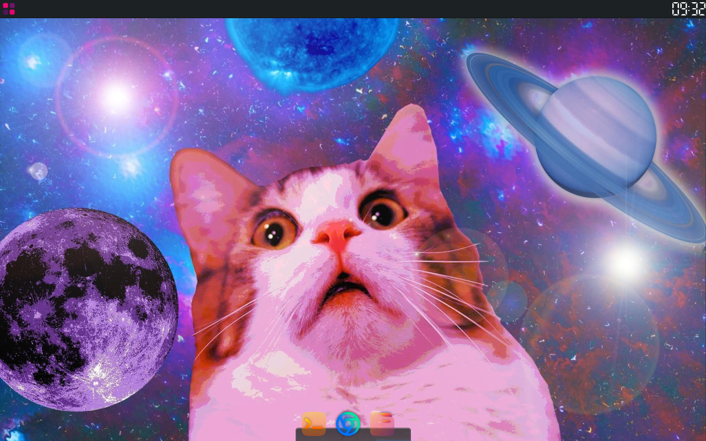

 

Sweet Kitty
===========================
<h4> My Openbox setup </h4>

 

 

## How to install my Openbox setup

1. *Clone this repository and go to the inside:*

git clone https://github.com/winvis300-max/SweetKitty.git 

cd SweetKitty

2. *Install the Openbox and depencedices:*

Debian/Ubuntu/Mint

sudo apt install plank xfce4-panel nitrogen xcompmgr openbox xfce4-whiskermenu-plugin lxappearance lxsession-logout
    
RHEL/Fedora/Nobara

sudo dnf install plank xfce4-panel nitrogen xcompmgr openboxxfce4-whiskermenu-plugin lxappearance lxsession-logout
    

Arch/Manjaro/CachyOS

yay -S plank xfce4-panel nitrogen xcompmgr openbox xfce4-whiskermenu-plugin lxappearance lxsession-logout

Defaults:

File manager: Nemo
Terminal: Terminator
Web Browser: Chromium
4. *Copy the themes and wallpaper:*

tar xf Sweet-mars.tar.xz
tar xf BeautySolar.tar-20241114161046.gz
unzip elementary-Dark.zip
sudo cp -r BeautySolar/ /usr/share/icons/
sudo cp -r Sweet-mars/ /usr/share/themes/
sudo cp -r elementary-Dark/ /usr/share/plank/themes/
sudo cp wp9511342-4248049388.jpg

5. *Set the themes:*

Type lxappearance to open the LXappearance
Selcet Sweet-mars for theme
Selcet the BeautySolar for the icons
After doing these click Apply and close the windows.
Right click to the plank with holp up Ctrl.
Click Prfernces.
Selcet the theme elementary-Dark
And enable the Icon Zoom.
 

6. *Set the autostart.sh:*
After all log out and selcet Openbox for the session.
Right click and selcet the Terminal emulator.
Type this commands:

sudo mkdir .config/openbox/
sudo nano .config/openbox/autostart.sh

After open the nano type this:

plank &
xfce4-panel &
nitrogen --restore &
xcompmgr &

Save end exit
7. *Set the wallpaper:*

Type nitrogen to terminal
Click Preferences
Click Add
Add the /usr/share/backgrounds/
Click Selcet
Click Ok
Click Automatic
Click Zoomed Fill
Click Apply
Logout and login
Right click to panel

8. *Set the panel:*

Right click to panel
Click to Panel
Click to Panel Preferences
Remove panel 2
Go to the Items
Remove evrything
Click Add
Add the Whisker Menu
Add a seprator
Add a clock
Open the seprator preferences
Enable the Expert
Click Close
Open the clock preferences
Click Digital
Selcet the LCD
Click Close
Open the Whisker Menu Preferences
Click Appearance
Change Icon to applications-all
Click Ok
Click Commands
Disable evrything
Enable Settings Manager
Change the commandd to lxsession-logout
Close the Window

9. *Set the Openbox theme:*

Right click to desktop
Click to ObConf
Selcet the Nightmare
And enjoy your new Desktop
